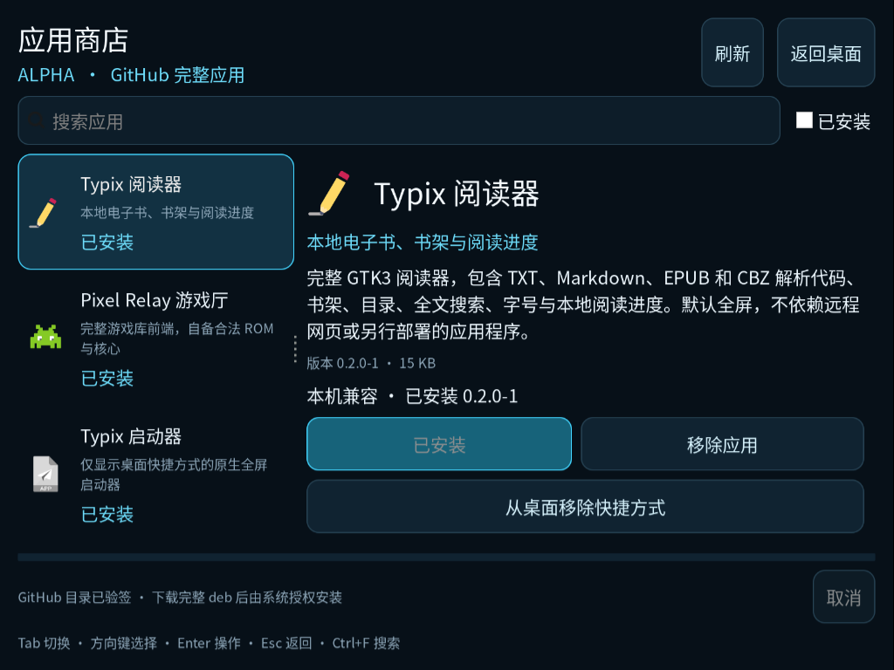
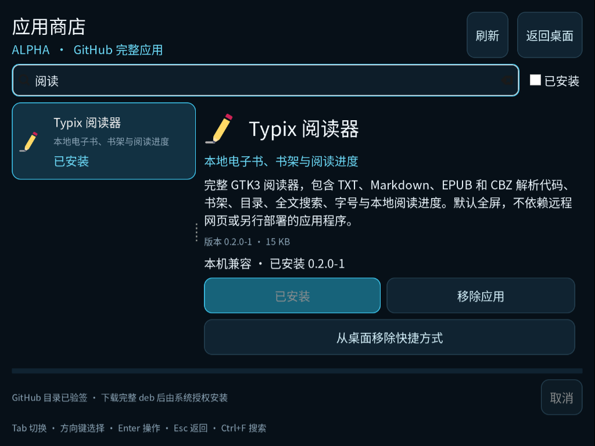

# TypixDeck Store 0.3 Alpha

原生 GTK3/PyGObject 全屏商店，支持从配置的公开 GitHub 仓库下载**完整 deb 软件包**，然后经过系统授权安装、更新、移除。标准 `.desktop` 快捷方式仍单独管理，安装不会自动向桌面堆放图标。没有浏览器、遥测或整机安装清单上传。

<!-- app-screenshots:start -->



应用目录、兼容性与桌面快捷方式管理。



按名称搜索应用并查看安装状态。

<!-- app-screenshots:end -->

界面沿用 Launcher 的深色背景、青色焦点和系统主题图标。支持搜索、详情、已安装筛选、Tab、方向键、Enter、Esc、Ctrl+F 和 F5。介绍和技术详情滚动，状态和三项操作固定可见。版本 0.3 延续 CM4、官方 Raspberry Pi OS ARM64 和约 800×600 逻辑显示要求。

## GitHub 应用源

管理员配置文件固定为 `/etc/typix-store/github.json`。配置、公钥及所有上级路径必须 root 所有、非符号链接且不可由普通用户改写。没有配置时继续使用签名离线应用源，不猜测仓库。

本项目目标仓库的 raw 模式示例见 [config/github.example.json](config/github.example.json)：

```json
{
  "repository": "typixdeck/store",
  "mode": "raw",
  "ref": "main",
  "directory": "debs",
  "publicKey": "/usr/share/typix-store/keys/development.pem"
}
```

raw 模式从 `raw.githubusercontent.com/typixdeck/store/main/debs/` 读取平铺的 `catalog.json`、`catalog.json.sig` 和 deb 文件。发布者必须先生成、校验并签名目录，再一起提交实际 deb；只提交软件包不会自动生成商店条目。完整包提交入口和发布流程见 [debs/README.md](debs/README.md) 与仓库的发布工具。

也支持 GitHub Release assets：`mode` 省略或为 `release`，`release` 默认 `latest`，可以固定 tag。文件 URL 分别由 `/releases/latest/download/<filename>` 或 `/releases/download/<tag>/<filename>` 派生。目录中的任意 URL 不被使用。只允许 GitHub HTTPS 主机及其明确的下载跳转主机，不携带登录凭据或 API token。

当 GitHub 尚未发布目录、网络失败或远程验签失败时，优先使用仍在有效期内的签名缓存，并显示失败/离线提示；没有有效缓存时回到本机签名离线应用源。过期缓存不能安装，错误签名不会覆盖可信目录。未实际发布远程文件前，不声称在线下载已经可用。

## 签名和完整软件包约定

`catalog.json.sig` 为对 `catalog.json` 原始字节的 Ed25519 原始二进制签名，公钥为 PEM SubjectPublicKeyInfo。使用 `python3-cryptography` 先验签，再解析 JSON。私钥不进入客户端包或设备。

沿用 schemaVersion 1、camelCase 字段。GitHub Release 频道为 `github-release`，raw 频道为 `github-repository`，顶层 `repository` 必须与系统配置完全一致。`generatedAt` 和 `expiresAt` 包含时区且目录处于有效期。应用记录示例：

```json
{
  "id": "ai.typixdeck.reader",
  "package": "typix-reader",
  "currentVersion": "0.3.0-1",
  "name": {"zh-CN": "阅读器"},
  "desktopFile": "typix-reader.desktop",
  "versions": [{
    "version": "0.3.0-1",
    "artifact": {
      "filename": "typix-reader_0.3.0-1_all.deb",
      "arch": "all",
      "sizeBytes": 12345,
      "sha256": "<实际文件的 64 位十六进制 SHA-256>",
      "depends": "python3, python3-gi",
      "payload": "complete-deb",
      "installedSizeBytes": 65536
    },
    "compatibility": {
      "arch": ["arm64"],
      "os": ["raspios-bookworm", "raspios-trixie"],
      "minMemoryMB": 128,
      "minFreeDiskMB": 64,
      "display": ["wayland", "x11"],
      "requiredFeatures": []
    }
  }]
}
```

GitHub 条目必须声明 `artifact.payload=complete-deb`，并提供发布者从实际 deb 文件内容累计得到的 `installedSizeBytes`（正数，上限 8 GiB），兼容性最低空间应覆盖展开大小及 64 MiB 余量。下载后、root 暂存后都重新检查展开所需空间，避免小体积高压缩包耗尽安装磁盘。这个签名声明由发布工具和提交者负责；密码学不能证明任意应用的功能完整。不能把依赖手动部署 `/opt/...` 的入口包装器当作完整软件发布。`filename` 只能是单个 deb 文件名，`desktopFile` 只能是 `/usr/share/applications` 下入口 basename。

安装前核对文件大小、SHA-256、deb 的 `Package`、`Version`、`Architecture`、`Depends`、`X-Typix-Compatible-OS`。签名声明与包内字段冲突时拒绝。架构、官方系统、内存、磁盘与显示能力均在运行时探测，不按 CM 型号硬编码。

## 下载、授权暂存和安装

所有网络和文件校验运行于工作线程。目录最大 4 MiB，签名 64 字节，软件包最大 1 GiB。每次网络读取超时 10 秒，目录每文件总预算 30 秒，软件包总预算 10 分钟；使用单次网络读取后检查截止时间与取消，避免慢速响应长期占住任务。

下载写入普通用户的 `XDG_CACHE_HOME/typix-store/github/<source-hash>/downloads`。按签名 SHA 命名，保留目标 `.part` 续传；Range 必须得到完全匹配的 Content-Range，服务器忽略 Range 时从头覆盖，完成后再次验证全量哈希。损坏的完整 partial 会清理后重试。每源只保留一个目录快照和当前软件包下载，检查空间后才继续；取消、网络中断和低存储都可重试。

普通用户缓存不能直接传给 PackageKit。下载完成后，GUI 通过 `pkexec /usr/libexec/typix-store-stage` 请求一次独立授权：

1. helper 用 `/usr/bin/python3 -I`，忽略用户 Python 路径和当前目录；配置、信任公钥、目标目录固定在系统路径。
2. 仅接受 catalog、签名、deb 的路径和应用 id；先检查当前 `PKEXEC_UID` 所有的普通文件，再用 `O_NOFOLLOW` 文件描述符核对 inode、owner、类型与大小，有界复制到 root 临时目录。
3. 独立重验系统配置、签名、仓库、频道、完整包标记、大小、SHA-256、deb 字段和本机架构/官方 OS/内存/空间。
4. 验证后原子写入 root 所有的 `/var/cache/typix-store/verified/<sha>.deb`。暂存串行锁和 2 GiB 缓存上限限制资源；缓存满时要求管理员清理已完成缓存，不自动删除正在使用的包。

helper 没有网络请求，不执行 dpkg 安装或系统修复，不修改授权规则。暂存结果写系统审计日志；GUI 再校验返回的固定路径和内容，然后通过既有 Gio 异步 PackageKit `InstallFiles` 请求安装授权。可有两次系统授权提示，GUI 不保留 root。

取消暂存等待不会杀 root helper；它最多完成已授权的有界暂存，取消后不会调用 PackageKit。进入 PackageKit 后，仅在 daemon 的 `AllowCancel=true` 时请求 `Cancel`，不杀 dpkg。移除只解析目标已安装包，`allow_deps=false`、`autoremove=false`，保留用户文档，不连带移除依赖。Launcher 和 Store 自身禁用移除入口。

授权失败、依赖缺失、锁冲突、未完成 dpkg 数据库、低空间、超时和服务断开均有提示。不会自动重放不确定事务、自动修复数据库或扩大升级范围。PackageKit 在安装系统依赖时可能需要网络。

## 本机离线源与预览模式

默认路径仍为：

```text
/usr/share/typix-store/repository/{catalog.json,catalog.json.sig,packages/*.deb}
/usr/share/typix-store/keys/development.pem
```

本机频道为 `development-offline`。历史 `config/catalog.json` 示例不会打进 Store deb。离线包路径、签名及公钥必须由 root 管理才能开启系统事务。用户目录显示“用户目录预览，系统安装待管理员部署”，禁用安装、更新、移除，保留浏览及快捷方式管理。

桌面目录通过 `xdg-user-dir DESKTOP` 获取。创建指向系统 `.desktop` 的链接，保留已有同名文件；只移除对应链接或完全相同副本，自定义文件交由文件管理器处理。只查询当前签名目录应用的安装状态，不收集整机安装清单。

## 构建和验证

```sh
PYTHONPATH=src python3 -m unittest discover -s tests -v
./build-deb.sh
```

产物 `dist/typix-store_0.3.0-1_all.deb`，架构 `all`，声明 Python/GTK3/cryptography/PackageKit/pkexec/xdg-user-dirs 依赖，以及官方 Raspberry Pi OS Bookworm、Trixie 兼容字段。

54 项本机测试覆盖签名、过期、真实 deb 元数据、能力与空间、GitHub URL/跳转约束、网络响应和取消、Range 恢复、损坏缓存重试、未发布目录回退、文件描述符安全与暂存二次验证、PackageKit 错误/取消/超时。网络响应测试使用受控响应，不能替代真实 GitHub 发布后 E2E。CM4 上实际 PackageKit 安装/移除、root 暂存、在线完整包下载及 GTK 验收证据由集成交付记录单独给出。

URL 规则依据 [GitHub Release 链接文档](https://docs.github.com/en/repositories/releasing-projects-on-github/linking-to-releases) 和 [GitHub 仓库内容文档](https://docs.github.com/en/rest/repos/contents)。

## 仓库目录

| 路径 | 用途 |
| --- | --- |
| `app.json` | 应用描述、完整 deb 版本与 SHA-256、截图索引 |
| `README.md` | 功能、真机截图、安装与使用说明 |
| `src/` | 当前程序源码或启动入口 |
| `packaging/` | desktop 与打包辅助文件 |
| `tests/` | 功能与边界验证 |
| `docs/screenshots/` | 可公开的真实运行截图 |
| `build-deb.sh` | 本地构建入口 |
| `dist/` | 构建生成的完整 deb；不提交 Git |

Store 另有 `debs/`（完整包提交与签名目录）、`tools/`（导入与发布工具）、`schemas/`（声明格式）和 `config/`（配置示例）。详情见 [应用仓库约定](docs/APP-REPOSITORY.md) 与 [发布流程](docs/PUBLISHING.md)。

构建后核对并更新 `app.json` 的版本、SHA-256 和截图索引。Store 发布工具读取声明并校验完整软件包；构建不会自动签名、上传或安装。应用仓库不包含用户数据、凭据、私钥或设备采集记录。
